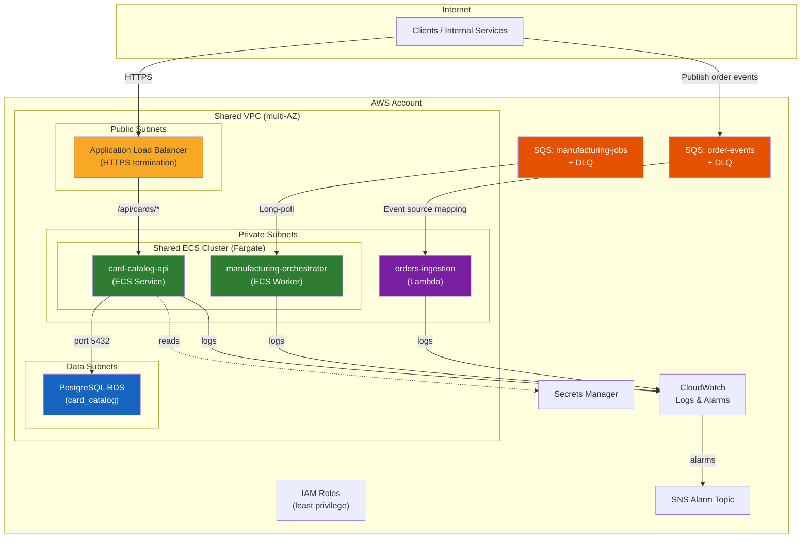

# Architecture

## Overview

The Foundry service catalog standardizes three workload patterns on AWS for Fanatics Collectibles backend services. Each service consumes shared platform infrastructure and composes reusable Terraform modules.

## Architecture Diagram

## Traffic Flow

### card-catalog-api (ECS API)
1. Clients send HTTPS requests to the shared ALB.
2. ALB listener rule routes `/api/cards/*` to the card-catalog-api target group.
3. ECS Fargate tasks in private subnets handle requests.
4. Application reads/writes to PostgreSQL RDS in data subnets.
5. DB credentials are retrieved from Secrets Manager (managed via `manage_master_user_password`).

### orders-ingestion (Lambda)
1. Upstream producers send order events to the `order-events` SQS queue.
2. Lambda event source mapping polls the queue in batches of 5.
3. Lambda processes each message; failures are reported via `ReportBatchItemFailures`.
4. Messages that fail 3 times are routed to the dead-letter queue.

### manufacturing-orchestrator (ECS Worker)
1. Manufacturing job messages arrive in the `manufacturing-jobs` SQS queue.
2. ECS Fargate worker tasks long-poll the queue using the AWS SDK.
3. Workers process jobs with a 300-second visibility timeout for long-running tasks.
4. Failed messages follow the same DLQ pattern after 3 retries.

## Trust Boundaries

| Boundary | Control |
|----------|---------|
| Internet → ALB | HTTPS termination, security groups |
| ALB → ECS tasks | Private subnets, security group ingress rules |
| ECS/Lambda → RDS | Security group-to-security group ingress, private data subnets |
| ECS/Lambda → SQS | IAM policies scoped to specific queue ARNs |
| ECS/Lambda → Secrets Manager | IAM policies scoped to specific secret ARNs |
| All compute | No public IP assignment, outbound-only internet via NAT Gateway |

## Shared Platform Foundation (assumed to exist)

The following resources are managed by a separate platform team and consumed as inputs:

- VPC with public, private, and data subnets across 2+ AZs
- ECS Fargate cluster
- ALB with HTTPS listener
- SNS topic for alarm notifications
- KMS keys for encryption
- NAT Gateway for outbound internet access
